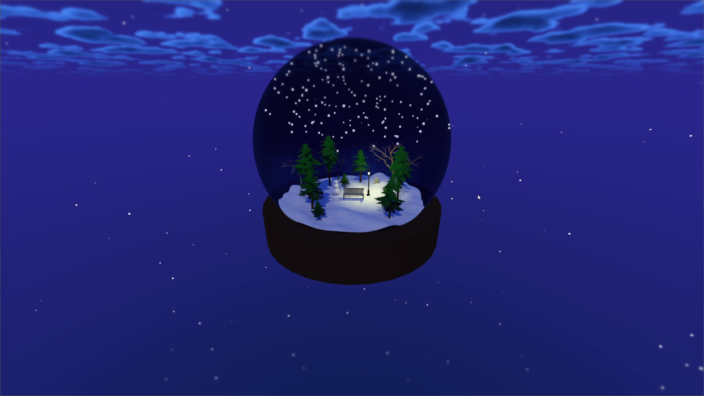

# Godot Snow Globe Demo

### Official source files for https://youtu.be/xJK5S-iTmkc

# Credits

- Stylized Sky Shader by **Gotibo**: https://godotshaders.com/shader/stylized-sky/
- Glass Shader by **SamWise**: https://godotshaders.com/shader/simple-3d-glass/
- Tilt Shift Shader by **Maaack**: https://godotshaders.com/shader/tilt-shift-shader-minimal/
- World Normal mix shader **Arnklit**: https://godotshaders.com/shader/world-normal-mix-shader/
- Trees from **Quaternius**: https://quaternius.com/packs/ultimatestylizednature.html
- Bench from **medwuf**: https://www.cgtrader.com/free-3d-models/furniture/chair/wooden-bench-b989c1fb-480a-46eb-abc2-ac03379646d2
- Streetlamp from **kukkory**: https://www.cgtrader.com/free-3d-models/architectural/architectural-street/urban-street-city-pack

# License

All code is licensed under the MIT license.
